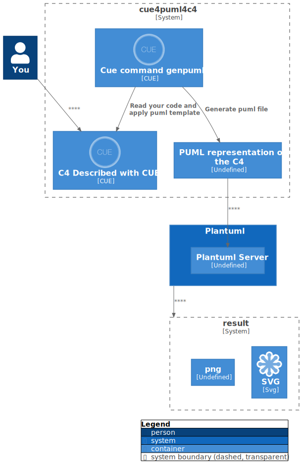

+++
title = "CUE4Puml4C4"
linkTitle = "CUE4Puml4C4"

+++



	<a class="btn btn-lg btn-primary mr-3 mb-4" href="">
		About this website and the library <i class="fas fa-arrow-alt-circle-right ml-2"></i>
	</a>
	<a class="btn btn-lg btn-secondary mr-3 mb-4" href="https://github.com/owulveryck/cue4puml4c4">
		GitHub Repo <i class="fab fa-github ml-2 "></i>
	</a>
	<a class="btn btn-lg btn-primary mr-3 mb-4" href="">
		Your first diagram <i class="fas fa-arrow-alt-circle-right ml-2"></i>
	</a>
	

Describe your C4 model as data (not as code) thanks to the CUE language.
Transpile it and render it thanks to plantuml.

	




{}
This library is a set of definitions to express a c4 diagram as data with the CUE language.

For example, the picture below, is generated thanks to [this code](illustration.cue) and rendered with [plantuml](https://www.plantuml.com/plantuml/uml/fL9TRzem57rkVeMNbmO9y4kUzjGkH7GIQoC2ctYAJ789rXmxyWS8JVtlkoPaP2tID5MAaflZS-x7yNqmbcdh6X5yuh8KhWAojxOrdodLx3YjkTsxhJEWIoKjI3ijLKDRmQJNJ8oj1D_I99va7bf_Mz266GiQeI911UCIzBJzp_pgwCG1zAdyIVky4uu4CvadMLz1xNQyv4nGn1BLD4f-f4xf8FRok8on09UK6GFMUFoSbdp4dvgBBTFuiCdrgDNSWkcdwN-dr1pgIyN5u-PblIeMZy-pF7dCqcWKF7sTfKM-IfVfosfpHkZz4WIpN4coOhMvfmIXL403qWuGae4sw22vfq4NHcliUXnkb0j7mPsdv2TifJbJkh3uefoic3v50tl6uU0d7FqAxlvST5GnoyPX4fCPc5BpBLJaY0wHP9s6Y9_V-622GgXQOU61k0RfioBF0K4R6oOhSW7_hJuffxEpFCDr8HfQ3GOzwAnHEsBtG98OzMjPmGur5SO-1_eNXTSwVWRyB85Ln2SbfQg0-5vOsueJyJI2vhJeEjpGzurWE0S96bcTPiU5vxzUp8twLS2EBz4RDtj23Xgtz4eZ7V1-bDTtzuOUE677OVTzcv-Nrcd83_KupB_FCGU6dSS6Wz4DRYQHsyhwLctSe7uL_GvTZF5RrhjwzNleqjzZ3adzITWFq1tcJoy_YaKwJvzdqIXu05aXvpS0)
{}

