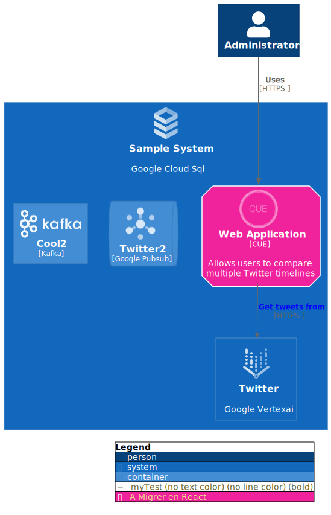

This sample code:

```cue
package main

import (
 "github.com/owulveryck/cue4puml4c4/technology/gcp"
 "github.com/owulveryck/cue4puml4c4/technology/dev"
 "github.com/owulveryck/cue4puml4c4/technology/stdlib"
 "github.com/owulveryck/cue4puml4c4:c4"
)

// Tags
elementsTags: [ID=_]: c4.#ElementTag & {
 id: "\(ID)"
}

relationsTags: [ID=_]: c4.#RelationTag & {
 id: "\(ID)"
}
elementsTags: aSupprimer: {
 legendText:  "A Migrer en React"
 bgColor:     "#f0239c"
 borderColor: "#ff0239c"
 technology:  dev.React
 shadowing:   true
 shape:       "eightsided"
}
relationsTags: myTest: {lineStyle: "bold"}
relationsTags: autreFleche: {lineColor: "#ff0000"}

// Containers

myWebApp: c4.#Container & {
 id:          "web_appp"
 label:       "Web Application"
 description: "Allows users to compare multiple Twitter timelines"
 technology:  dev.CUE
 tags: [elementsTags.aSupprimer]
}

myothercontainer: c4.#Container & {
 id:         "othercontainer"
 label:      "Cool2"
 technology: stdlib.Kafka
}

othersample: c4.#Container & {
 id:         "sample2"
 label:      "Twitter2"
 technology: gcp.Pubsub
 link:       "https://www.twitter.com"
}

twitter: c4.#System & {
 id:         "twitter"
 label:      "Twitter"
 technology: gcp.Vertexai
 link:       "https://www.twitter.com"
}

sampleSystem: c4.#System & {
 id:    "c1"
 label: "Sample System"
 containers: [myWebApp, othersample, myothercontainer]
 technology: gcp.CloudSql
 systems: [twitter]
}

admin: c4.#Person & {
 id:    "admin"
 label: "Administrator"
}

C1: c4.#C1 & {
 elementTags:  elementsTags
 relationTags: relationsTags
 Persons: [admin]
 Systems: [sampleSystem]
 Relations: [
  {source: admin, dest:    myWebApp, description: "Uses", protocol:            "HTTPS ", tags: [relationsTags.myTest]},
  {source: myWebApp, dest: twitter, description:  "Get tweets from", protocol: "HTTPS ", link: "https://plantuml.com/link"},
 ]
}
```

Generates this plantuml file:

```plantuml
@startuml MyName
!include https://raw.githubusercontent.com/plantuml-stdlib/C4-PlantUML/master/C4_Container.puml
!include https://raw.githubusercontent.com/owulveryck/PlantUML-icons-GCP/master/official/GCPCommon.puml
!include https://raw.githubusercontent.com/owulveryck/cue4puml4c4/main/assets/cue.puml
!include https://raw.githubusercontent.com/owulveryck/PlantUML-icons-GCP/master/official/cloud_sql/cloud_sql.puml
!include https://raw.githubusercontent.com/owulveryck/PlantUML-icons-GCP/master/official/pubsub/pubsub.puml
!include https://raw.githubusercontent.com/owulveryck/PlantUML-icons-GCP/master/official/vertexai/vertexai.puml
!include https://raw.githubusercontent.com/plantuml-stdlib/gilbarbara-plantuml-sprites/master/sprites/./kafka.puml

/'Relation Tags'/
AddRelTag("autreFleche",$lineColor="#ff0000")
AddRelTag("myTest",$lineStyle=BoldLine())

/'Element Tags'/
AddElementTag("aSupprimer",$bgColor="#f0239c",$borderColor="#ff0239c",$shadowing="true",$shape="EightSidedShape()",$legendText="A Migrer en React",$techn="React",$sprite="react")

/' Persons '/
Person(admin,"Administrator")

/' Systems '/
System(c1,"Sample System","Google Cloud Sql","cloud_sql"){
 Container(web_appp,"Web Application","CUE","Allows users to compare multiple Twitter timelines","cue_logo",$tags="aSupprimer+ ")
 ContainerQueue(sample2,"Twitter2","Google Pubsub","","pubsub",$link="https://www.twitter.com")
 Container(othercontainer,"Cool2","Kafka","","kafka")
 System(twitter,"Twitter","Google Vertexai","vertexai",$link="https://www.twitter.com")
}

/' Relations '/
Rel("admin","web_appp","Uses","HTTPS ",$tags="myTest+ ")
Rel("web_appp","twitter","Get tweets from","HTTPS ",$link="https://plantuml.com/link")
SHOW_LEGEND()
@enduml
```

Which give this picture:


