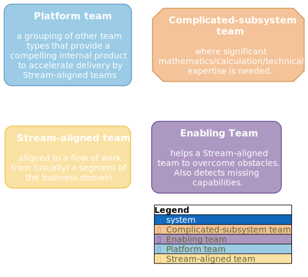

# Team Topologies tags

usage:

```cue
package main

import (
 "github.com/owulveryck/cue4puml4c4:c4"
 "github.com/owulveryck/cue4puml4c4/tags/teamtopologies:tt"
)

ptf: c4.#System & {
 id:    "ptf"
 label: "Platform team"
 description: """
  a grouping of other team types that provide a compelling internal product to accelerate delivery by Stream-aligned teams
  """
 link: "https://teamtopologies.com/key-concepts"
 tags: [tt.platformTeam]
}
streamAligned: c4.#System & {
 id:    "streamAligned"
 label: "Stream-aligned team"
 description: """
   aligned to a flow of work from (usually) a segment of the business domain
  """
 link: "https://teamtopologies.com/key-concepts"
 tags: [tt.streamAlignedTeam]
}

complicatedSubSystem: c4.#System & {
 id:    "complicatedSubSystem"
 label: "Complicated-subsystem team"
 description: """
   where significant mathematics/calculation/technical expertise is needed.
  """
 link: "https://teamtopologies.com/key-concepts"
 tags: [tt.complicatedSubsystemTeam]
}

enabling: c4.#System & {
 id:    "enabling"
 label: "Enabling Team"
 description: """
   helps a Stream-aligned team to overcome obstacles. Also detects missing capabilities.
  """
 link: "https://teamtopologies.com/key-concepts"
 tags: [tt.enablingTeam]
}

C1: c4.#C1 & {
 Systems: [ptf, complicatedSubSystem, streamAligned, enabling]
}
```


